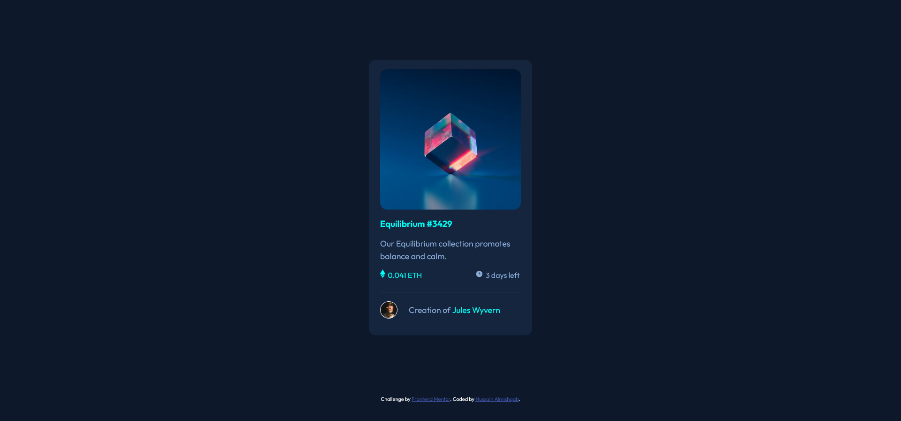

# Frontend Mentor - NFT preview card component solution

This is a solution to the [NFT preview card component challenge on Frontend Mentor](https://www.frontendmentor.io/challenges/nft-preview-card-component-SbdUL_w0U). Frontend Mentor challenges help you improve your coding skills by building realistic projects.
## Table of contents

- [Overview](#overview)
  - [Screenshot](#screenshot)
  - [Links](#links)
- [My process](#my-process)
  - [Built with](#built-with)
  - [What I learned](#what-i-learned)
- [Author](#author)

## Overview

### Screenshot

### Links

- Solution URL: [https://github.com/sam3ds/NFT-preview-card-component](https://github.com/sam3ds/NFT-preview-card-component)
- Live Site URL: [https://sam3ds.github.io/NFT-preview-card-component/](https://sam3ds.github.io/NFT-preview-card-component/)

## My process

### Built with

- HTML5
- CSS

### What I learned

I learned how to make hover overlay effect with HTML & CSS

## Author

- Frontend Mentor - [@sam3ds](https://www.frontendmentor.io/profile/sam3ds)
